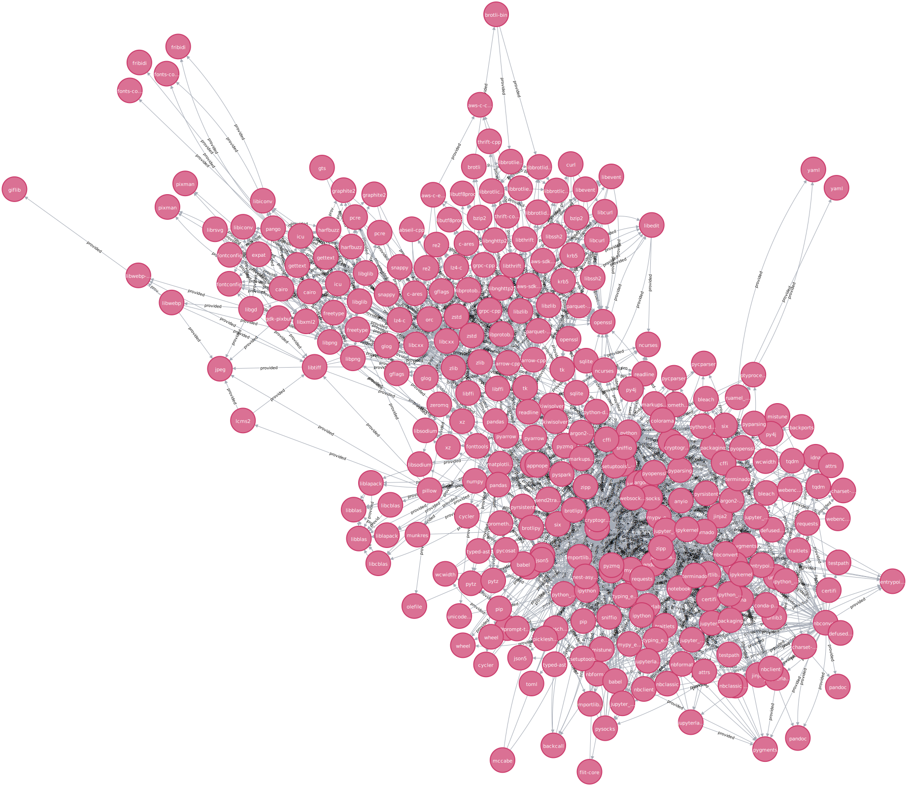

[](https://github.com/maropu/pydeps/blob/master/LICENSE)

This repository is to analyze Python package dependencies.

## Exports Conda Package Dependencies into Neo4j

To analyze the package dependencies of a current active conda environment, it is useful to export them
into [Neo4j Aura](https://neo4j.com/cloud/aura), a fully-managed graph dtabase service:

```
./export-pydeps-into-neo4jaura.py --uri neo4j+s://<your Neo4j database uri> --user <user name> --password <password>
```

For instance, the dependent packages of [spark-data-repair-plugin](https://github.com/maropu/spark-data-repair-plugin) are shown as follows:

<p align="center"></p>

### List of Useful CYPHER Queries to Analyze Dependencies

#### Packages that No Other Package Depends on

```
MATCH (p:RootPackage) RETURN p
```

#### Dependencies of a Specific Package

```
MATCH path=(p)-[*]->(:Package)
WHERE p.name = 'py4j'
RETURN path
```

#### Which Packages Depend on a Specific Package

```
MATCH path=()-[*]->(p:Package)
WHERE p.name = 'py4j'
RETURN path
```

#### Cyclic Dependencies

```
MATCH path=(p1)-[*1..]->(p2)
WHERE p1.name = p2.name
RETURN path
```

#### Packages Required by Two or More Packages

```
MATCH (p1)-[t:provided]->(p2:Package)
WITH p2, count(p1) AS num_deps, collect(distinct t.required) AS required
WHERE num_deps >=2
RETURN p2, num_deps, required
ORDER BY num_deps DESC
```

## TODO

 * Adds more useful CYPHER queries in the list above
 * Support other Python package management tools (e.g., pip)

## Bug Reports

If you hit some bugs and have requests, please leave some comments on [Issues](https://github.com/maropu/spark-sql-flow-plugin/issues)
or Twitter ([@maropu](http://twitter.com/#!/maropu)).
