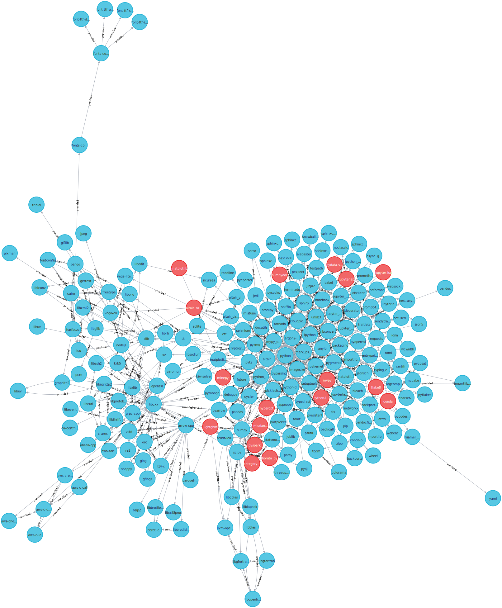

[](https://github.com/maropu/pydeps-neo4j/blob/master/LICENSE)

This repository is to analyze Python package dependencies in Neo4j.

## Exports Python Package Dependencies into Neo4j

To analyze package dependencies in a Python environment, it is useful to export them
into [Neo4j Aura](https://neo4j.com/cloud/aura), a fully-managed graph dtabase service:

```
./pydeps-neo4j.py --uri neo4j+s://<your Neo4j database uri> --user <user name> --password <password>
```

For instance, the dependent packages of [spark-data-repair-plugin](https://github.com/maropu/spark-data-repair-plugin) are shown as follows:

<p align="center"></p>

`pydeps-neo4j.py` uses the internal API of `pip` by default.
If one would like to export dependencies in a conda environment, you can use an option `--conda-env-prefix` instead:

```
./pydeps-neo4j.py --conda-env-prefix <conda env path> <the Neo4j options given above>
```

### List of Useful CYPHER Queries to Analyze Dependencies

#### Packages that No Other Package Depends on

```
MATCH (p:RootPackage) RETURN p
```

#### Dependencies of a Specific Package

```
MATCH path=(p)-[*]->(:Package)
WHERE p.name = 'py4j'
RETURN path
```

#### Which Packages Depend on a Specific Package

```
MATCH path=()-[*]->(p:Package)
WHERE p.name = 'py4j'
RETURN path
```

#### Cyclic Dependencies

```
MATCH path=(p1)-[*1..]->(p2)
WHERE p1.name = p2.name
RETURN path
```

#### Packages Required by Two or More Packages

```
MATCH (p1)-[t:provided]->(p2:Package)
WITH p2, count(p1) AS num_deps, apoc.coll.toSet(apoc.coll.flatten(collect(distinct t.requires))) AS requires
WHERE num_deps >=2
RETURN p2, num_deps, requires
ORDER BY num_deps DESC
```

## TODO

 * Adds more useful CYPHER queries in the list above

## Bug Reports

If you hit some bugs and have requests, please leave some comments on [Issues](https://github.com/maropu/spark-sql-flow-plugin/issues)
or Twitter ([@maropu](http://twitter.com/#!/maropu)).
